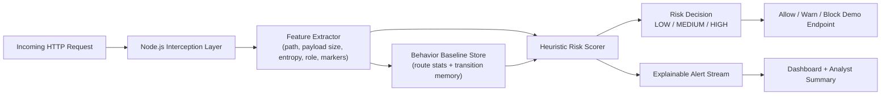

# Sentinel AI: Behavior-Based Threat Detection System

A lightweight, signature-independent threat detection demo that scores suspicious behavior in real time by learning a baseline of normal request flows and flagging anomalous traffic patterns.

## Problem Statement

Traditional security systems heavily depend on known attack signatures, so previously unseen exploit behavior can slip through until damage is already done. This project demonstrates an early-warning anomaly detection pipeline that identifies suspicious behavior patterns without requiring a known threat database.

## What This Project Demonstrates

- Behavior profiling for routes, payload sizes, payload entropy, and route transitions
- Real-time anomaly scoring without depending on a known-bad signature database
- Explainable alerts with reasons such as request bursts, privilege abuse, unusual transitions, and suspicious payload structures
- A dashboard that makes the invisible security pipeline visible during a live hackathon demo
- A traffic simulator for comparing normal user behavior against attack-like sequences
- A deterministic analyst-summary layer that turns raw anomalies into a readable incident briefing

## Architecture



## Detection Logic

The engine assigns risk based on multiple behavior signals:

- Request burst frequency over a 10-second sliding window
- Suspicious payload/path markers such as traversal, SQL-style, script, or command-execution probes
- Privileged endpoint access from a guest role
- Unusual route-to-route transitions compared with the learned baseline
- Payload size spikes relative to historical route averages
- High-entropy payload structures
- Previously unseen routes after baseline warm-up

Each event receives:

- `riskScore` from 0 to 100
- `riskLevel` as LOW / MEDIUM / HIGH
- `intent` such as Directory Traversal Probe, Privilege Escalation Attempt, Sequence Anomaly, or Automated Recon / Bot Burst
- human-readable `reasons`

## Project Structure

```text
src/
  server.js                 # HTTP server + demo routes + dashboard APIs
  engine/
    baselineStore.js        # Normal-behavior baseline learning
    featureExtractor.js     # Request feature extraction
    riskScorer.js           # Heuristic anomaly scoring
public/
  index.html
  styles.css
  app.js                    # Live dashboard polling and visualization
simulator/
  scenarioRunner.js         # Shared scenario runner used by CLI + dashboard buttons
  run-simulation.js         # Normal vs attack traffic generator
```

## Run Locally

Install Node.js 18+ first, then run:

```bash
npm start
```

Open the dashboard:

```text
http://localhost:3000
```

You can run everything directly from the dashboard buttons:

- Reset Engine
- Simulate Normal Traffic
- Simulate Attack Traffic

Or use the CLI simulator in a second terminal.

Generate baseline traffic:

```bash
npm run simulate:normal
```

Then launch attack-like behavior:

```bash
npm run simulate:attack
```

## Demo Story for Judges

1. Start the server and open the dashboard.
2. Run normal simulation first so the engine learns a baseline.
3. Show that ordinary routes stay LOW risk and populate the Learned Route Baseline panel.
4. Run attack simulation.
5. Point out the Live Attack Timeline spike, HIGH-risk rows in Live Threat Events, and the dominant attack labels in Threat Intent Breakdown.
6. Use the Threat Analyst Summary card to explain what happened, which session was suspicious, why it was flagged, and what response is recommended.
7. Highlight that this is signature-independent: the engine does not need a threat database to raise an alert.

## Technical Moat

- Signature-independent behavioral detection
- Sequence-aware route transition analysis instead of single-request-only checks
- Explainable scoring with transparent reasons and incident summaries
- One-click simulation and reset flow for repeatable live demos
- Dependency-light Node.js implementation that can evolve into Express middleware or an npm package

## MVP Scope and Honest Positioning

This project should be presented as an **early-warning anomaly detection engine for potentially unknown attacks**, not as a guaranteed zero-day blocker. That framing is stronger and more credible in front of judges.

## Suggested Next Improvements

- Add per-user rolling baselines and decay windows
- Store events in Redis or SQLite for persistence
- Add an optional LLM explanation layer for analyst-friendly incident summaries
- Convert the detection layer into Express middleware or an installable npm package
- Add threshold tuning and false-positive controls in the dashboard

## Tech Stack

- Backend: Node.js HTTP server
- Detection Engine: rule-based + heuristic anomaly scoring
- Frontend: vanilla JavaScript, HTML, CSS, Canvas chart
- Storage: in-memory baseline/session/event state for lightweight demo execution
